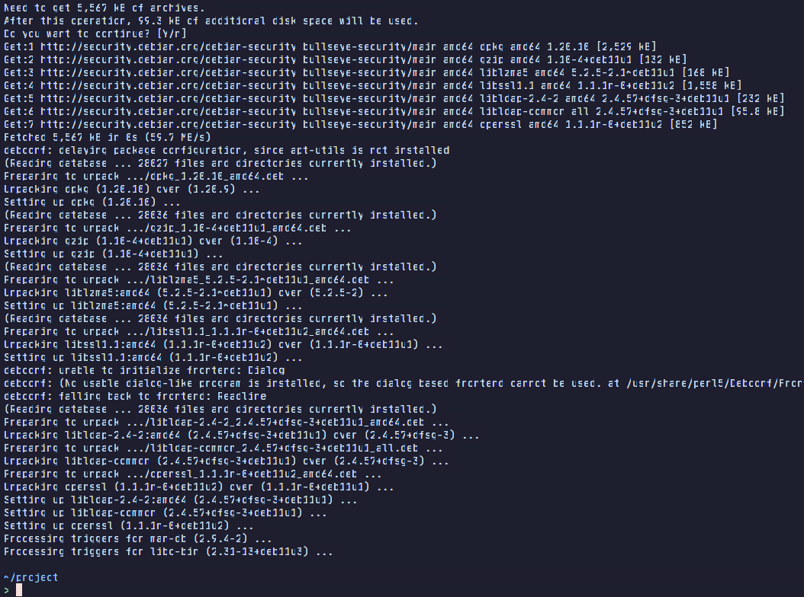

# Code Server Font Patch

This patchs [code-server](https://github.com/cdr/code-server) to enable load fonts [JetBrains Mono](https://github.com/JetBrains/JetBrainsMono) in server.

CSS from [here](https://gist.github.com/aasmpro/95776294ecf48bd7d0562504bad848ea)

## Installation

- Clone this repository.

```bash
git clone https://github.com/Podter/code-server-font-patch.git
cd code-server-font-patch
```

- Run this command (change `path-to-code-server` to your code-server path, leave it empty if you install code-server from installer or code-server is in `/usr/lib/code-server`):

```bash
sudo ./patch.sh [path-to-code-server]
```

## Settings

You may need to set font family in code-server settings:

```
"editor.fontFamily": "JetBrainsMonoNF, JetBrainsMono, monospace",
"terminal.integrated.fontFamily": "JetBrainsMonoNF, JetBrainsMono, monospace",
```

## Glitch text in terminal

To fix this, you need to disable privacy features or extensions like DuckDuckGo Privacy Essentials extension.

[Github issue](https://github.com/coder/code-server/issues/5036#issuecomment-1126991999)

[xterm.js FAQ](https://github.com/xtermjs/xterm.js/wiki/FAQ)
